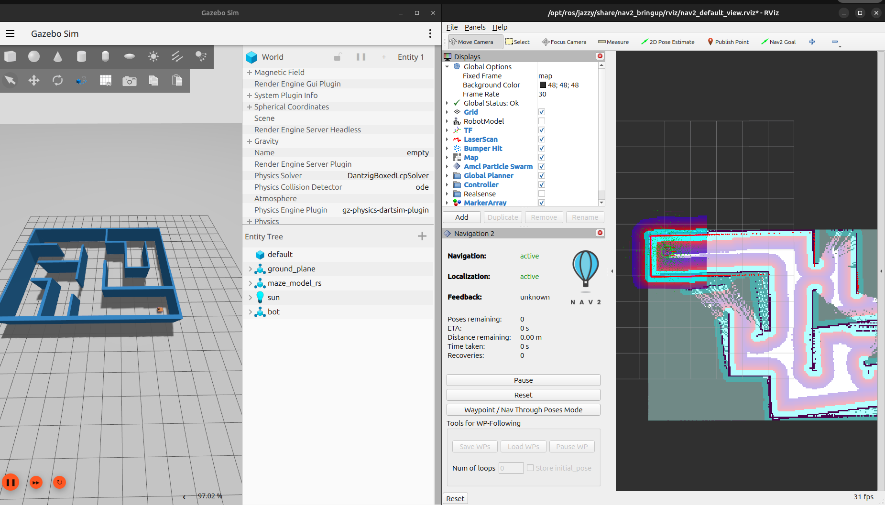

# Robot_indoor
Développement d’un système de navigation autonome pour un robot mobile en intérieur



## Description

Robot_indoor est un projet de navigation intérieure pour un robot mobile équipé d’un **LiDAR** et d’une **caméra de profondeur**.  
Le robot peut construire une **carte 2D** de son environnement en utilisant SLAM Toolbox, se localiser, et naviguer de façon autonome via le système de navigation de Nav2. La simulation est réalisée avec Gazebo Sim Harmonic.  

Le projet a pour objectif de fournir une base modulaire et collaborative — simulation, cartographie, navigation — afin d’expérimenter la navigation indoor et d’étendre facilement les fonctionnalités (capteurs, évitement d’obstacles, etc.).

## Fonctionnalités principales

- Construction de carte 2D via SLAM (SLAM Toolbox)    
- Navigation autonome dans un environnement intérieur  
- Simulation complète avec Gazebo Sim Harmonic  
- Support LiDAR + caméra de profondeur  

## Dépendances

### Système / OS

- Ubuntu 24.04  
- ROS2 Jazzy  

###  ROS2 & packages nécessaires

```bash

sudo apt install ros-jazzy-nav2-*
sudo apt install ros-jazzy-slam-toolbox
sudo apt install ros-jazzy-robot-state-publisher
sudo apt install ros-jazzy-joint-state-publisher-gui

```
## Installation & Build

### Créer workspace
```bash
mkdir -p ~/ros2_ws/src
cd ~/ros2_ws/src
```

### Cloner le dépôt
```bash
git clone https://github.com/themasterofarts/Robot_indoor.git
cd ~/ros2_ws
```

### Installer les dépendances
```bash
rosdep install --from-paths src --ignore-src -r -y
```

### Construction  et source de l'environnement
```bash
colcon build
source install/setup.bash

```

### Lancer la simulation
```bash
ros2 launch robot_indoor view.launch.py
```

### Lancer les serveurs de Nav2
```bash
ros2 launch indoor_navigation indoor_nav.launch.py
```

### Creation de la carte
```bash
ros2 launch indoor_navigation mapping.launch.py
```
## Comment contribuer

Les contributions sont les bienvenues ! Que ce soit pour :

- l’ajout de fonctionnalités (capteurs, algorithmes, environnement,…),

- l’amélioration de la navigation ou de la simulation,

- l’optimisation de la cartographie / localisation,

- l’écriture de documentation,

- la correction de bugs,

- des tests ou validations.

Processus proposé :

- Fork du dépôt.

- Créer une branche pour ta feature / correction :
```bash
git checkout -b feature/ma-nouvelle-feature
```

- Implémenter la modification, puis committer avec un message clair & significatif.

- Pousser la branche sur ton fork.

- Ouvrir une Pull Request vers la branche main du dépôt original.

Tu peux aussi ouvrir Issues pour signaler des bugs ou proposer des améliorations avant de coder.

Merci d’avance pour tes contributions ! 🙏


## Démonstration

