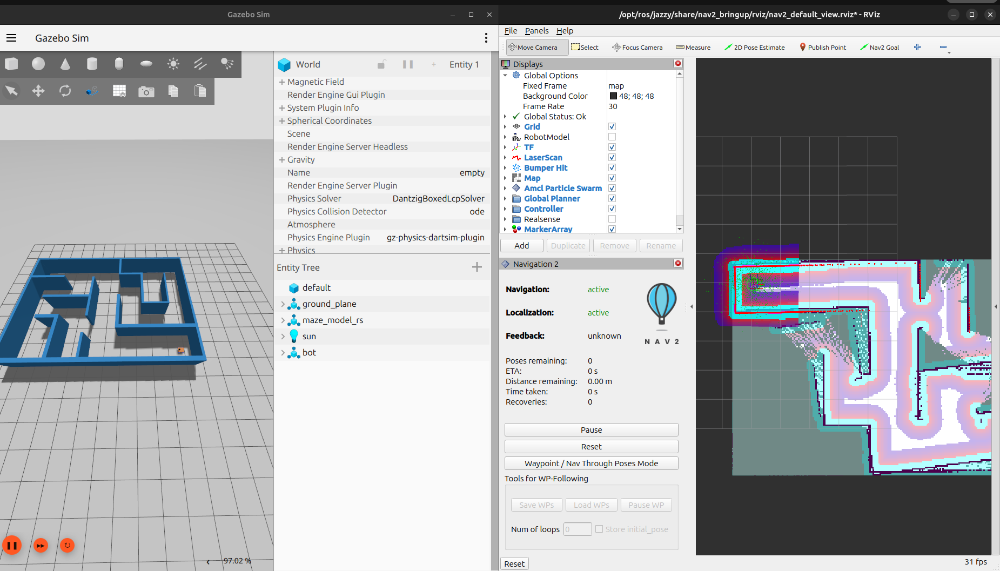

# Robot_indoor

Robot_indoor est une plateforme de développement ROS 2 pour la simulation de robots mobiles en environnement intérieur. Le projet est porté dans un esprit communautaire par MA64 Robotics et s'adresse aux étudiants, enseignants, développeurs et passionnés de robotique qui souhaitent expérimenter la navigation autonome dans un cadre académique et évolutif.



## Objectif du projet

L'objectif principal est de proposer une base de travail claire pour apprendre, tester et étendre des briques de robotique mobile :

- modélisation d'un robot mobile ;
- simulation sous Gazebo Sim ;
- cartographie 2D avec SLAM Toolbox ;
- localisation et navigation autonome avec Nav2 ;
- visualisation et interaction avec RViz ;
- expérimentation de scénarios indoor avec obstacles, capteurs et acteurs simulés.

Le projet ne cherche pas à fournir un produit final figé. Il sert plutôt de support d'apprentissage et de développement pour construire progressivement des comportements robotiques plus avancés.

## Contexte

Robot_indoor s'inscrit dans un contexte académique et collaboratif autour de la robotique mobile. Il met l'accent sur la simulation afin de permettre des tests reproductibles sans dépendre immédiatement d'un robot physique.

La plateforme peut être utilisée pour :

- découvrir ROS 2 et ses outils de navigation ;
- comprendre les interactions entre robot, capteurs, simulateur et pile de navigation ;
- développer de nouveaux scénarios de simulation ;
- expérimenter des algorithmes de cartographie, d'exploration ou de suivi ;
- préparer une transition future vers un robot réel.

## Fonctionnalités principales

- Simulation d'un robot mobile indoor avec Gazebo Sim Harmonic.
- Description robot via URDF/Xacro.
- Pont de communication ROS 2 et Gazebo avec `ros_gz_bridge`.
- Capteurs simulés : LiDAR, caméra, caméra de profondeur, IMU et odométrie.
- Visualisation avec RViz.
- Cartographie 2D avec SLAM Toolbox.
- Navigation autonome avec Nav2.
- Exploration de frontières via le package `indoor_navigation`.
- Environnement Docker et Devcontainer pour simplifier l'installation.

## Architecture générale

Le dépôt est organisé autour de plusieurs composants complémentaires :

```text
robot_indoor/
├── robot_indoor/                 # Package ROS 2 principal : robot, launch, mondes, RViz
├── indoor_navigation/            # Package ROS 2 pour SLAM, Nav2 et exploration
├── gazebo-ros-actor-plugin/      # Plugin Gazebo pour acteurs simulés
├── docker/                       # Image Docker et script de lancement de l'environnement
├── .devcontainer/                # Configuration Devcontainer pour VS Code
└── docs/                         # Page GitHub Pages et ressources de documentation
```

Les principaux fichiers de lancement sont :

- `robot_indoor/launch/view.launch.py` : démarre la simulation Gazebo, le robot et les ponts ROS/Gazebo ;
- `indoor_navigation/launch/mapping.launch.py` : démarre SLAM Toolbox pour créer une carte ;
- `indoor_navigation/launch/indoor_nav.launch.py` : démarre la pile Nav2 ;
- `indoor_navigation/launch/frontier_exploration.launch.py` : démarre l'exploration automatique par frontières.

## Technologies utilisées

- Ubuntu 24.04
- ROS 2 Jazzy
- Gazebo Sim Harmonic
- Nav2
- SLAM Toolbox
- RViz2
- `ros_gz`, `ros_gz_bridge`, `ros_gz_image`
- URDF et Xacro
- Python et CMake
- Docker et Devcontainer
- GitHub Actions pour l'intégration continue
- GitHub Pages pour la documentation web

## Installation

Deux méthodes sont possibles : l'environnement Docker recommandé pour démarrer rapidement, ou une installation native sur Ubuntu 24.04 avec ROS 2 Jazzy.

### Méthode recommandée avec Docker

Prérequis :

- Docker installé ;
- une session graphique Linux avec la variable `DISPLAY` disponible ;
- un accès GitHub configuré pour cloner le dépôt et ses sous-modules.

```bash
git clone git@github.com:themasterofarts/Robot_indoor.git
cd Robot_indoor
git submodule update --init --recursive
./docker/run-dev.sh
```

Le script `docker/run-dev.sh` construit l'image si elle n'existe pas encore, puis ouvre un conteneur interactif avec les volumes et variables nécessaires pour Gazebo et RViz.

Dans le conteneur :

```bash
source /opt/ros/jazzy/setup.bash
rosdep update
rosdep install --from-paths . --ignore-src -r -y --rosdistro jazzy
colcon build --symlink-install
source install/setup.bash
```

### Installation native

Prérequis :

- Ubuntu 24.04 ;
- ROS 2 Jazzy installé ;
- `rosdep` et `colcon` configurés.

Installer les dépendances principales :

```bash
sudo apt update
sudo apt install -y \
  python3-colcon-common-extensions \
  python3-rosdep \
  ros-dev-tools \
  ros-jazzy-joint-state-publisher \
  ros-jazzy-joint-state-publisher-gui \
  ros-jazzy-nav2-bringup \
  ros-jazzy-navigation2 \
  ros-jazzy-robot-state-publisher \
  ros-jazzy-ros-gz \
  ros-jazzy-ros-gz-bridge \
  ros-jazzy-ros-gz-image \
  ros-jazzy-ros-gz-sim \
  ros-jazzy-rviz2 \
  ros-jazzy-slam-toolbox \
  ros-jazzy-tf2-ros \
  ros-jazzy-xacro
```

Cloner et construire le projet :

```bash
mkdir -p ~/ros2_ws/src
cd ~/ros2_ws/src
git clone git@github.com:themasterofarts/Robot_indoor.git
cd Robot_indoor
git submodule update --init --recursive

cd ~/ros2_ws
source /opt/ros/jazzy/setup.bash
rosdep update
rosdep install --from-paths src --ignore-src -r -y --rosdistro jazzy
colcon build --symlink-install
source install/setup.bash
```

## Utilisation

### Lancer la simulation

Dans un terminal préparé avec l'environnement ROS 2 :

```bash
ros2 launch robot_indoor view.launch.py
```

Cette commande démarre Gazebo, charge le monde de simulation, génère le robot et active les ponts de communication entre ROS 2 et Gazebo.

### Créer une carte avec SLAM Toolbox

Dans un second terminal :

```bash
source install/setup.bash
ros2 launch indoor_navigation mapping.launch.py
```

Le robot peut ensuite être déplacé dans l'environnement afin de construire une carte 2D.

### Lancer la navigation autonome

```bash
source install/setup.bash
ros2 launch indoor_navigation indoor_nav.launch.py
```

La navigation s'appuie sur Nav2 et peut être pilotée depuis RViz avec un objectif de navigation.

### Lancer l'exploration de frontières

```bash
source install/setup.bash
ros2 launch indoor_navigation frontier_exploration.launch.py
```

Cette commande démarre un noeud d'exploration qui sélectionne des frontières à partir de la carte afin de proposer des objectifs de navigation.

## Exemples simples

Envoyer une commande de vitesse ponctuelle :

```bash
ros2 topic pub /cmd_vel geometry_msgs/msg/Twist \
  "{linear: {x: 0.2}, angular: {z: 0.0}}" --once
```

Afficher les topics disponibles :

```bash
ros2 topic list
```

Vérifier la disponibilité des packages du projet :

```bash
ros2 pkg list | grep -E "robot_indoor|indoor_navigation"
```

Voir la démonstration vidéo :

[Démonstration de navigation indoor](docs/assets/indoor_nav_v.mp4)

## Captures et schémas à ajouter

Cette section peut être enrichie au fur et à mesure du développement :

- schéma général ROS 2, Gazebo, Nav2 et RViz ;
- capture du robot dans Gazebo ;
- capture de la carte générée par SLAM Toolbox ;
- capture d'une navigation dans RViz ;
- schéma des topics principaux ;
- vidéo courte d'un scénario complet.

## Documentation GitHub Pages

Une page web légère est disponible dans le dossier `docs/`. Elle peut être publiée avec GitHub Pages depuis la branche `main`, source `/docs`.

Commandes proposées :

```bash
git add README.md docs/
git commit -m "docs: add project documentation page"
git push origin main
```

Dans GitHub :

1. Ouvrir `Settings`.
2. Aller dans `Pages`.
3. Choisir `Deploy from a branch`.
4. Sélectionner la branche `main`.
5. Sélectionner le dossier `/docs`.
6. Enregistrer.

L'URL attendue sera généralement :

```text
https://themasterofarts.github.io/Robot_indoor/
```

## Contribution

Les contributions sont bienvenues. Le projet peut évoluer par ajout de capteurs, amélioration des mondes Gazebo, optimisation de la navigation, correction de bugs, rédaction de documentation ou ajout de scénarios pédagogiques.

Processus recommandé :

```bash
git checkout -b feature/ma-contribution
git add .
git commit -m "feat: describe the contribution"
git push origin feature/ma-contribution
```

Il est ensuite possible d'ouvrir une Pull Request vers la branche principale du dépôt. Les Issues peuvent aussi être utilisées pour signaler un bug, proposer une amélioration ou discuter d'une idée avant de l'implémenter.

## Contact

- Projet : MA64 Robotics
- Dépôt GitHub : [themasterofarts/Robot_indoor](https://github.com/themasterofarts/Robot_indoor)
- Mainteneur indiqué dans les packages ROS 2 : `klein <kleinfy51@gmail.com>`
